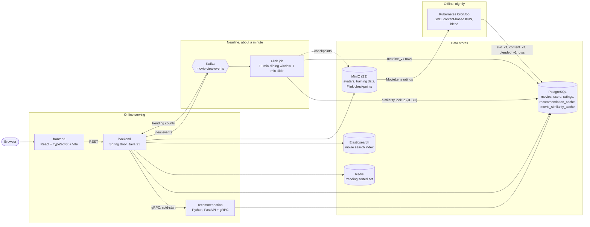
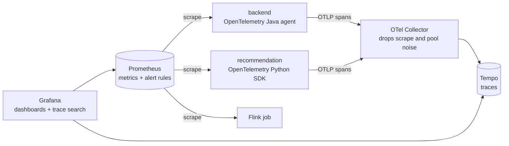

# Movie Recommendation System

A movie browsing and recommendation app built as three services, with three recommendation paths
that work at different speeds: an offline nightly pipeline, a nearline streaming job, and an
online request-time path. It runs locally with docker-compose and on Kubernetes (minikube), with
metrics, alerts and distributed tracing.

## Architecture



### Observability



One trace covers a request end to end: backend HTTP, its SQL, the gRPC call, the Python gRPC
handler and its SQL. Both services print the trace id on every log line, so a trace found in
Grafana can be matched to its log lines and back.

## The three recommendation paths

| Path | Runs | What it does | Where the result lives |
| --- | --- | --- | --- |
| Offline | Nightly CronJob | Trains SVD on ratings and a content-based KNN on movie metadata, then blends the two | `recommendation_cache` (`blended_v1`), `movie_similarity_cache` (`content_v1`) |
| Nearline | Flink, continuously | Scores candidates from each user's views in a 10 minute sliding window, using the precomputed movie similarities | `recommendation_cache` (`nearline_v1`) |
| Online | Per request | Backend merges fresh nearline rows into the offline list, weighted by how recent they are, and backfills with trending movies. New users get genre-based cold-start recommendations from the Python service over gRPC | Not stored |

The backend never calls the Python service for personalized recommendations: they are read
straight from Postgres. Only cold-start goes over gRPC, and the user id for that call always comes
from the JWT, never from client input.

## Repository layout

| Path | Contents |
| --- | --- |
| `frontend/` | React + TypeScript + Vite + Tailwind CSS |
| `backend/` | Spring Boot (Java 21): REST API, auth, Kafka producer and consumer, Flyway migrations |
| `recommendation/` | Python: gRPC cold-start service, offline training and blending jobs |
| `streaming/` | Java Flink job for nearline recommendations |
| `proto/` | gRPC contract shared by `backend/` and `recommendation/` |
| `monitoring/` | Prometheus, alert rules, Grafana dashboards, OTel Collector and Tempo config (shared by docker-compose and Kubernetes) |
| `k8s/` | Kubernetes manifests: one file per service, the Flink deployment, the nightly CronJob, and `monitoring/` (kustomize) |

## Running locally

```bash
# Everything except the backend
docker compose up -d

# Backend (runs on the host)
cd backend && ./gradlew bootRun
```

The frontend is at http://localhost:5173, the backend at http://localhost:8080 and Grafana at
http://localhost:3000.

Tracing is opt-in:

```bash
docker compose -f docker-compose.yml -f docker-compose.otel.yml up -d otel-collector tempo recommendation
cd backend && ./gradlew bootRun -Potel
```

Traces are in Grafana under Explore, with the Tempo datasource.

## Case study: finding a slow request with traces

A latency survey of the main endpoints, read from Tempo, showed cold-start recommendations for a
user with genre picks to be the slowest request by a wide margin: 130 ms at the median, against
20 to 55 ms for the others.

The trace pointed at the cause. Of the 120 ms spent in the Python gRPC handler, the SQL spans
accounted for only about 43 ms. The remaining 77 ms was inside the handler but outside any query.
The handler was fetching every movie that shared a genre with the user (5,949 of the 9,730 movies
for a user who picked Action and Drama), building a Python dict for each one, scoring and sorting
them all, and then keeping 10.

The fix moved the scoring, ordering and `LIMIT` into a single SQL query, so only the rows that
will be returned leave the database.

| `GET /api/recommendations/cold-start` (server span) | Before | After | Change |
| --- | --- | --- | --- |
| p50 | 130.1 ms | 41.0 ms | 68% lower |
| p95 | 172.6 ms | 46.9 ms | 73% lower |
| Rows fetched from Postgres per request | 11,900 | 12 | |
| SQL queries per request (Python service) | 3 | 2 | |

Measured on a local docker-compose stack: 100 sequential requests after 20 warm-up requests, as a
user with two genre picks, with durations read from the backend's server span in Tempo. The old
and new rankings were compared across 252 genre combinations at two limits and matched in every
case.
