# Movie Recommendation System

A movie browsing and recommendation app built as three services, with three recommendation paths
that work at different speeds: an offline nightly pipeline, a nearline streaming job, and an
online request-time path. It runs locally with docker-compose and on Kubernetes (minikube), with
metrics, alerts and distributed tracing.

## Screenshots

**Home page.** A signed-in user sees personalized recommendations, the trending row fed by view
events, and new releases.

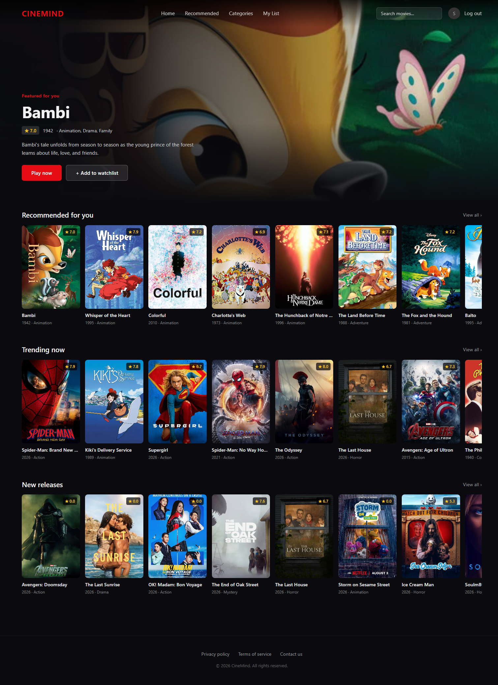

**Onboarding and cold-start.** A new user picks genres in step 2, and step 3 shows cold-start
recommendations built from those picks.

| Step 2: pick genres | Step 3: cold-start recommendations |
| --- | --- |
| 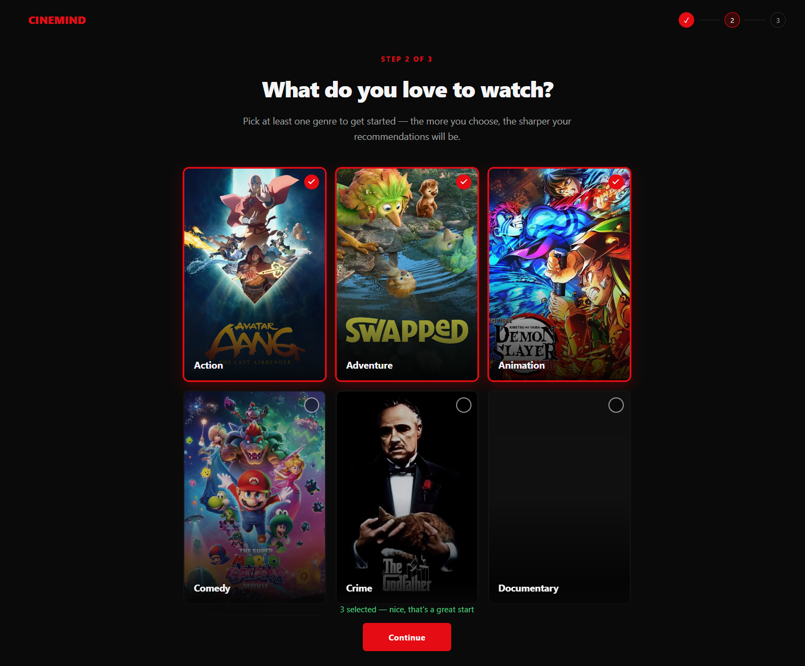 | 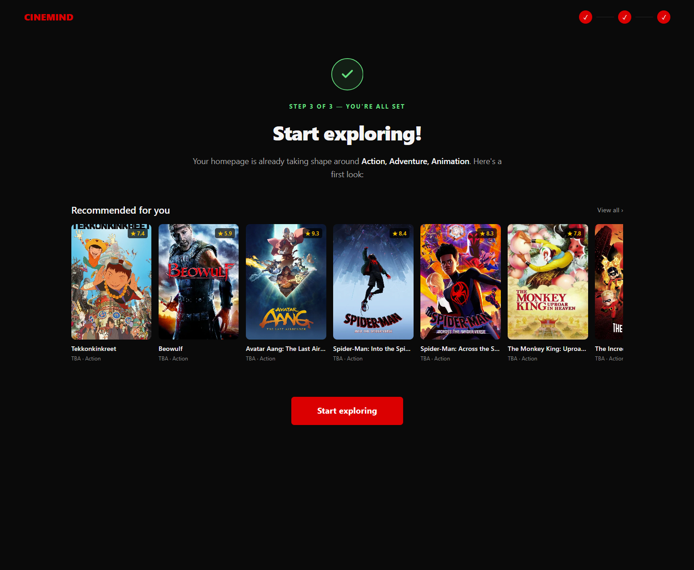 |

**Movie detail and search.** The detail page shows cast, director and similar movies from the
content-based model. Search runs on Elasticsearch with genre and rating filters.

| Movie detail with "More like this" | Search results for "spider man" |
| --- | --- |
| 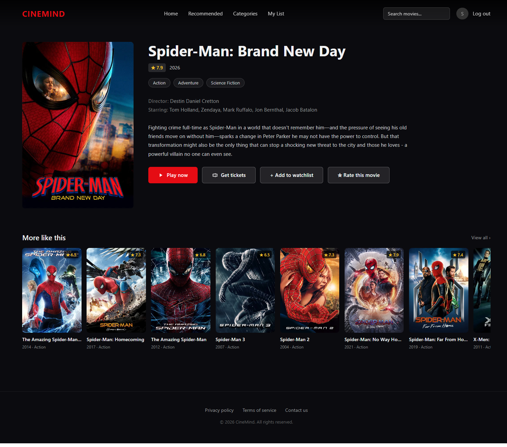 | 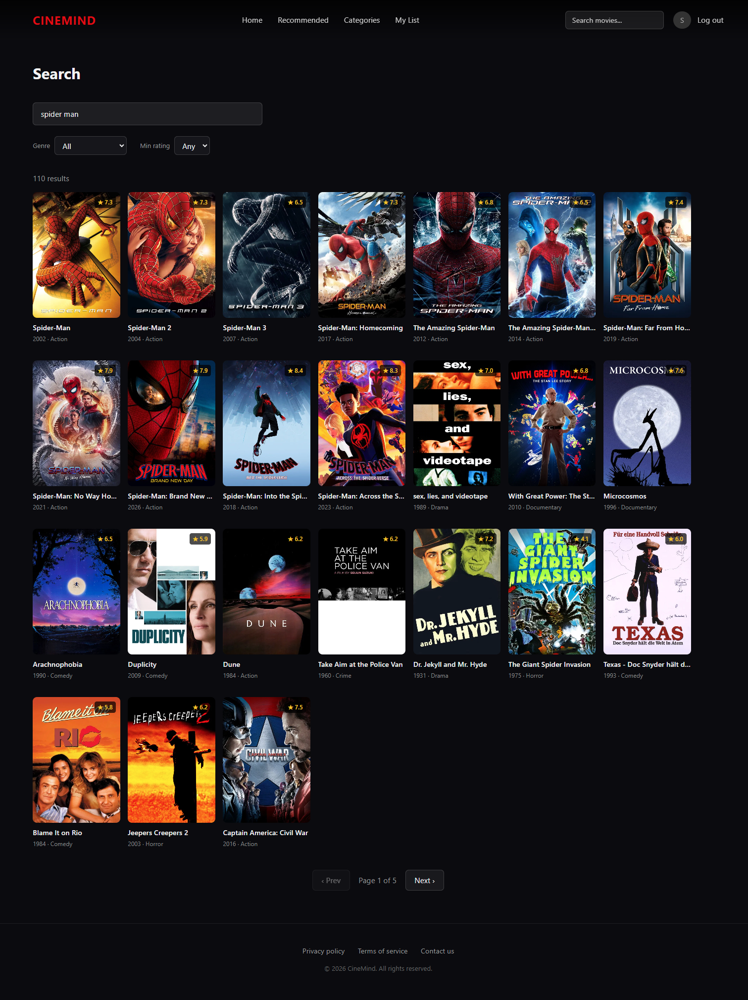 |

More screenshots are in the [Observability](#observability) section below.

## Architecture

The system is split by how fast each part has to react: online processing answers a request in
milliseconds, nearline processing reacts to what a user just watched within about a minute, and
offline processing retrains the models every night. The three parts never call each other
directly; they meet in the data stores.

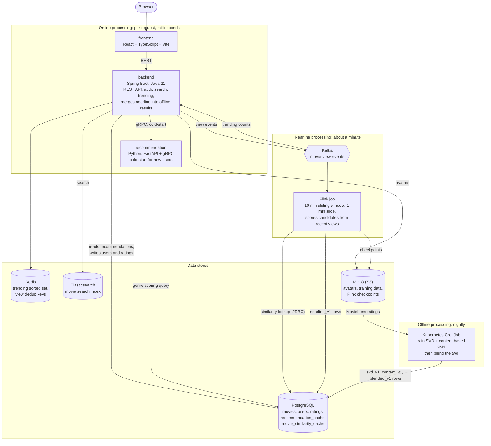

### Observability

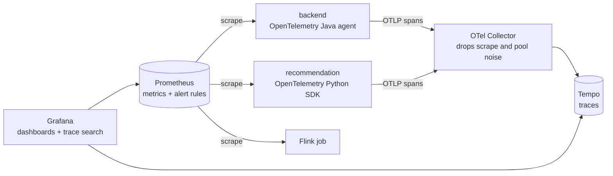

One trace covers a request end to end: backend HTTP, its SQL, the gRPC call, the Python gRPC
handler and its SQL. Both services print the trace id on every log line, so a trace found in
Grafana can be matched to its log lines and back.

**One trace across both services.** A cold-start request in Grafana Tempo: the backend's spans are
blue and the Python service's are green, with the gRPC call joining them.

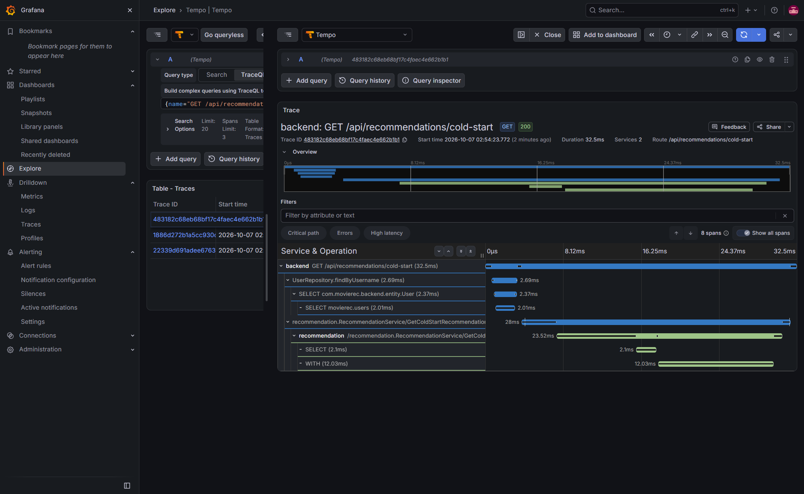

**Trace volume by service.** Span rate and duration for both services during a 30 minute run.

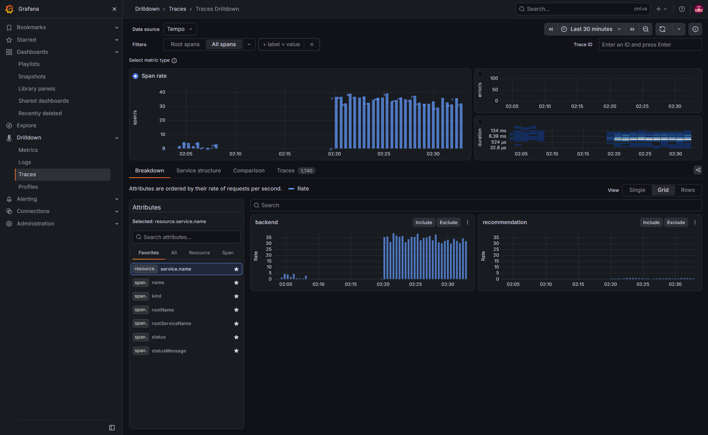

**Nearline dashboard.** Freshness, recovery and saturation for the Flink job: output reaches
Postgres about 19 s after a window closes, with one running job, no restarts and no failed
checkpoints.

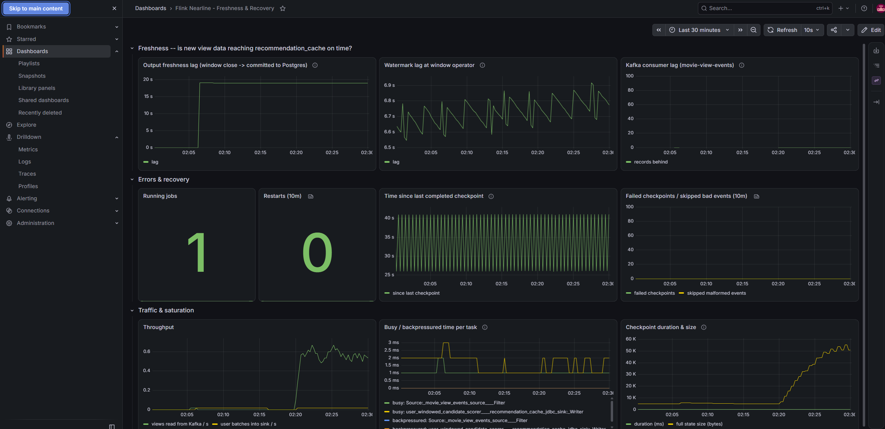

**Flink job.** The running job graph, and its checkpoint history with a checkpoint completing
every 30 s.

| Job graph | Checkpoint history |
| --- | --- |
| 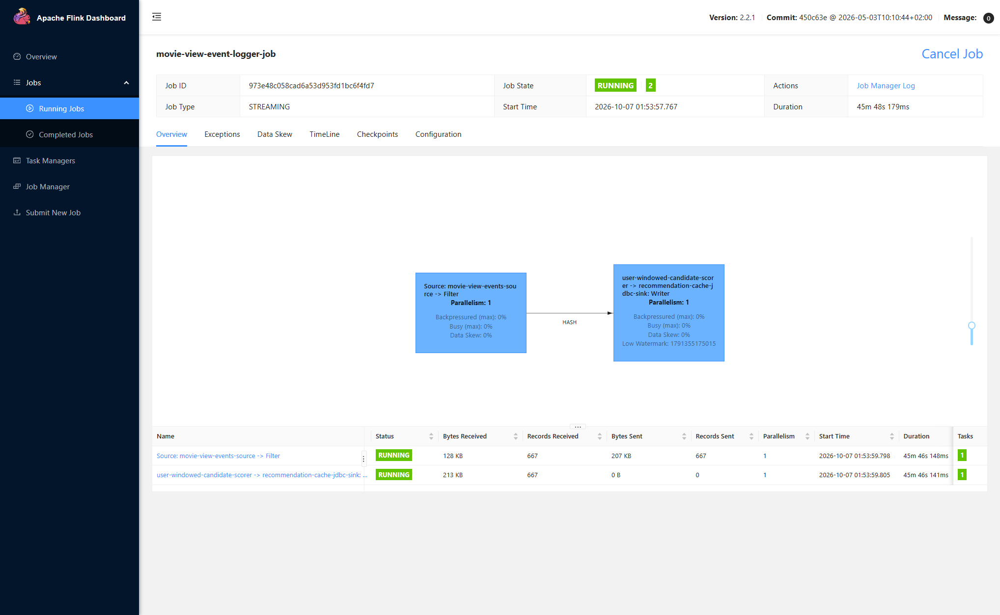 | 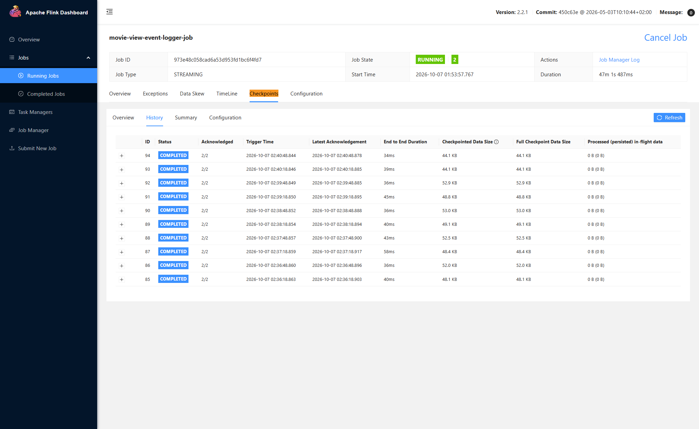 |

**Prometheus.** All four scrape targets up, and the eight alert rules for the nearline job.

| Scrape targets | Alert rules |
| --- | --- |
| 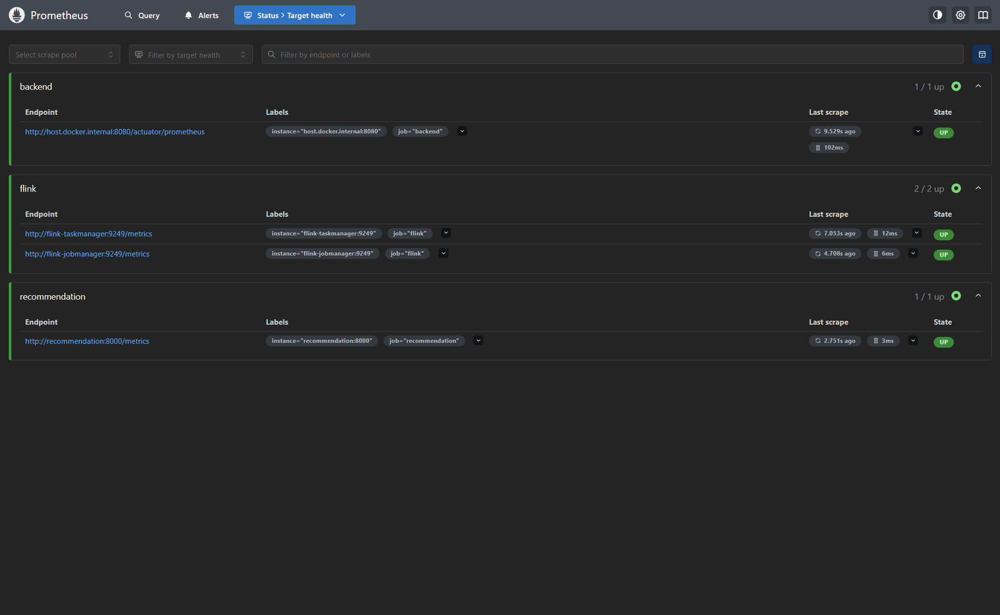 | 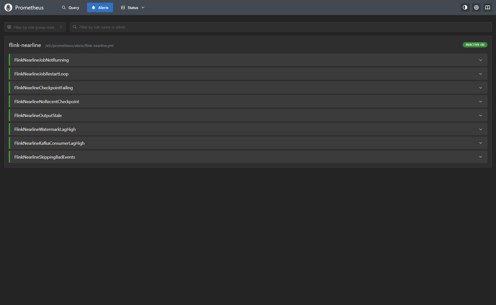 |

## The three recommendation paths

| Path | Runs | What it does | Where the result lives |
| --- | --- | --- | --- |
| Offline | Nightly CronJob | Trains SVD on ratings and a content-based KNN on movie metadata, then blends the two | `recommendation_cache` (`blended_v1`), `movie_similarity_cache` (`content_v1`) |
| Nearline | Flink, continuously | Scores candidates from each user's views in a 10 minute sliding window, using the precomputed movie similarities | `recommendation_cache` (`nearline_v1`) |
| Online | Per request | Backend merges fresh nearline rows into the offline list, weighted by how recent they are, and backfills with trending movies. New users get genre-based cold-start recommendations from the Python service over gRPC | Not stored |

The backend never calls the Python service for personalized recommendations: they are read
straight from Postgres. Only cold-start goes over gRPC, and the user id for that call always comes
from the JWT, never from client input.

## What was built

In the order it was built. Numbers are explained under [Measured results](#measured-results).

**Foundation**

- Web app in React 19, TypeScript, React Router, Vite and Tailwind CSS on a Spring Boot 4 (Java 21)
  backend with Spring Data JPA and Lombok, exposing 18 REST endpoints.
- PostgreSQL 16 schema managed by 14 versioned Flyway migrations, seeded with 9,730 movies plus
  cast and director data from MovieLens and TMDB. Everything runs in Docker Compose.
- JWT authentication with Spring Security and JJWT, avatar storage on MinIO (S3 API), and TLS
  termination with Nginx and Certbot.

**Events and cold-start**

- Movie-view events flow through Kafka into a Redis sorted-set trending leaderboard. Repeat views
  within 30 s are dropped with `SET NX`: 1,200 views in a load test produced exactly 600 events,
  at about 700 views/s and 19 ms p50.
- The cold-start path for new users is a genre-based recommender in Python (FastAPI, Uvicorn,
  psycopg2), served over gRPC so only the backend can reach it. It answers in 35 ms p50 end to end.

**Offline path**

- SVD (scikit-surprise) trained on 100,515 MovieLens ratings from 610 users, tuned over 8
  hyperparameter sets with 5-fold cross-validation (RMSE 0.873 to 0.865), and a cosine KNN
  (scikit-learn) on movie metadata. Ratings are stored as Parquet (pandas, PyArrow) in MinIO.
- An evaluation harness scores both models on a leakage-free holdout (precision, recall, NDCG and
  coverage at k=5 and k=10), and a blending step merges them into one ranked list per user.
- The whole pipeline runs nightly as a Kubernetes CronJob with a 600 s deadline, 1 retry and a
  2.5 GB memory limit, sized from a measured 79 s run with a 2 GB peak.

**Nearline path**

- A Flink 2.2 job (Java 17) consumes view events from Kafka over a 10 minute sliding window with a
  3 minute recency half-life. Fresh recommendations reach Postgres 13 to 32 s after each 1 minute
  window closes.
- Similarity lookups went from up to 10 JDBC queries per movie to 1 batched query behind a
  Caffeine cache (30 minute TTL). Sink writes went from 1 transaction per user per window to 1 per
  30 s checkpoint.
- Checkpoints go to MinIO every 30 s and are kept 7 days. Restarts back off from 1 s to 1 minute,
  and malformed events are skipped and counted instead of failing the job.
- On Kubernetes the job runs under the Flink Kubernetes Operator (installed with Helm) with
  Kubernetes HA. After its TaskManager pod was killed, the job resumed from its latest checkpoint
  in 34 s.

**Online path**

- The backend merges fresh nearline results into the offline list at request time (15 minute
  half-life, 0.5 weight cap, 2 hour cutoff) and backfills with trending movies.
- Full-text search over all 9,730 movies with Elasticsearch 9. Requiring all terms to match and
  boosting exact phrases raised actor-name precision@5 from 15% to 97%, at 13 ms p50.

**Kubernetes and observability**

- All services run on Kubernetes (minikube): 14 pods using about 4.9 GB. A killed pod is replaced
  and Ready in 8 s (recommendation) or 33 s (backend).
- Prometheus and Grafana with metrics from Spring Actuator, Micrometer and
  prometheus-fastapi-instrumentator, 8 alert rules and 2 dashboards. A stopped Flink job raised an
  alert within 40 s.
- OpenTelemetry tracing (Java agent, Python SDK, Collector, Tempo) links 5 hops in one trace per
  request, for under 2 ms of added p50 latency and about 156 MB of backend memory.
- Traces then found the slowest request and led to the fix in the
  [case study](#case-study-finding-a-slow-request-with-traces): p50 130 ms to 41 ms.

**Testing**

- 181 automated tests: 68 in the backend (JUnit 5, MockMvc, Spring Security Test), 15 in the Flink
  job (Flink test utils) and 98 in the Python service (pytest).

## Tech stack

| Area | Technology | Used for |
| --- | --- | --- |
| Languages | Java 21 | Backend |
| | Java 17 | Flink job |
| | Python 3.12 | Recommendation service, offline training |
| | TypeScript | Frontend |
| | SQL | Flyway migrations, cold-start scoring query, Flink lookups |
| | Protocol Buffers | gRPC contract in `proto/` |
| Frontend | React 19, React Router 7 | UI pages and routing |
| | Vite 8 | Dev server and build |
| | Tailwind CSS 4, PostCSS, Autoprefixer | Styling |
| | oxlint | Linting |
| Backend | Spring Boot 4.1 (Web MVC) | REST API |
| | Spring Security, JJWT | JWT authentication |
| | Spring Data JPA, Hibernate | Database access |
| | Flyway | Schema migrations |
| | Spring Kafka | Produces view events, consumes them for trending |
| | Spring Data Redis | Trending leaderboard, view dedup |
| | Spring Data Elasticsearch | Movie search |
| | gRPC Java | Client for the cold-start call |
| | MinIO Java client | Avatar uploads |
| | Spring Boot Actuator, Micrometer | Metrics endpoint |
| | Bean Validation, Lombok, Gradle | Request validation, boilerplate, build |
| Recommendation | FastAPI, Uvicorn | App process hosting the gRPC server and metrics |
| | grpcio | gRPC server for cold-start |
| | psycopg2 | PostgreSQL access |
| | scikit-surprise | SVD, grid search, cross-validation |
| | scikit-learn | Content-based KNN |
| | pandas, PyArrow (Parquet) | Training data preparation and storage format |
| | MinIO Python client | Reads training data |
| | prometheus-fastapi-instrumentator | Service metrics |
| Streaming | Apache Flink 2.2 | Sliding-window nearline job |
| | Flink Kafka connector | Consumes `movie-view-events` |
| | JDBC (PostgreSQL driver) | Similarity lookups, recommendation sink |
| | Caffeine | In-job cache for similarity lookups |
| | Jackson | Event deserialization |
| | Shadow plugin, Flink S3 (Presto) plugin | Fat jar, checkpoints to MinIO |
| Data stores | PostgreSQL 16 | Movies, users, ratings, recommendation and similarity caches |
| | Apache Kafka 3.9 | View-event stream |
| | Redis 7 | Trending sorted set, `SET NX` dedup |
| | Elasticsearch 9.4 | Movie search index |
| | MinIO (S3-compatible) | Avatars, training data, Flink checkpoints |
| Infrastructure | Docker, Docker Compose | Local environment, images |
| | Kubernetes (minikube) | Deployments, Services, Secrets, PVCs, Jobs, RBAC, CronJob |
| | Flink Kubernetes Operator, Helm | Runs the Flink job with Kubernetes HA |
| | Kustomize | Generates monitoring ConfigMaps from `monitoring/` |
| | Nginx, Certbot (Let's Encrypt) | Reverse proxy, TLS termination |
| Observability | Prometheus | Metrics, alert rules, Kubernetes pod discovery |
| | Grafana | Dashboards, trace search |
| | OpenTelemetry Java agent, Python SDK, Collector | Tracing |
| | Grafana Tempo | Trace storage |
| Testing | JUnit 5, MockMvc, Spring Security Test | Backend tests |
| | Flink test utils | Streaming job tests |
| | pytest | Recommendation service tests |
| Data sources | MovieLens | Ratings and movie catalogue |
| | TMDB | Movie metadata and credits |

## Repository layout

| Path | Contents |
| --- | --- |
| `frontend/` | React + TypeScript + Vite + Tailwind CSS |
| `backend/` | Spring Boot (Java 21): REST API, auth, Kafka producer and consumer, Flyway migrations |
| `recommendation/` | Python: gRPC cold-start service, offline training and blending jobs |
| `streaming/` | Java Flink job for nearline recommendations |
| `proto/` | gRPC contract shared by `backend/` and `recommendation/` |
| `monitoring/` | Prometheus, alert rules, Grafana dashboards, OTel Collector and Tempo config (shared by docker-compose and Kubernetes) |
| `k8s/` | Kubernetes manifests: one file per service, the Flink deployment, the nightly CronJob, and `monitoring/` (kustomize) |

## Running locally

```bash
# Everything except the backend
docker compose up -d

# Backend (runs on the host)
cd backend && ./gradlew bootRun
```

The frontend is at http://localhost:5173, the backend at http://localhost:8080 and Grafana at
http://localhost:3000.

Tracing is opt-in:

```bash
docker compose -f docker-compose.yml -f docker-compose.otel.yml up -d otel-collector tempo recommendation
cd backend && ./gradlew bootRun -Potel
```

Traces are in Grafana under Explore, with the Tempo datasource.

## Case study: finding a slow request with traces

A latency survey of the main endpoints, read from Tempo, showed cold-start recommendations for a
user with genre picks to be the slowest request by a wide margin: 130 ms at the median, against
20 to 55 ms for the others.

The trace pointed at the cause. Of the 120 ms spent in the Python gRPC handler, the SQL spans
accounted for only about 43 ms. The remaining 77 ms was inside the handler but outside any query.
The handler was fetching every movie that shared a genre with the user (5,949 of the 9,730 movies
for a user who picked Action and Drama), building a Python dict for each one, scoring and sorting
them all, and then keeping 10.

The fix moved the scoring, ordering and `LIMIT` into a single SQL query, so only the rows that
will be returned leave the database.

| `GET /api/recommendations/cold-start` (server span) | Before | After | Change |
| --- | --- | --- | --- |
| p50 | 130.1 ms | 41.0 ms | 68% lower |
| p95 | 172.6 ms | 46.9 ms | 73% lower |
| Rows fetched from Postgres per request | 11,900 | 12 | |
| SQL queries per request (Python service) | 3 | 2 | |

Measured on a local docker-compose stack: 100 sequential requests after 20 warm-up requests, as a
user with two genre picks, with durations read from the backend's server span in Tempo. The old
and new rankings were compared across 252 genre combinations at two limits and matched in every
case.

## Measured results

Everything here was measured on one laptop, with the load generator on the same machine, on
2026-10-07. Treat the numbers as evidence that each part works and roughly how it behaves, not as
production capacity.

| What | Result | How it was measured |
| --- | --- | --- |
| View-event throughput | 600 views in 0.85 s (about 700/s), p50 18.9 ms, p95 28.9 ms | 16 concurrent clients on `GET /api/movies/{id}`, warmed up, docker-compose |
| View dedup | 1,200 views produced exactly 600 Kafka events | Each of 600 movies viewed twice within 30 s by one user |
| Cold-start latency | p50 35.1 ms, p95 42.6 ms | 200 sequential requests after 300 warm-ups, client-side, user with one genre pick |
| Search latency | p50 13.3 ms, p95 16.4 ms | Same protocol, `GET /api/search` |
| Search relevance | Actor-name precision@5: 0.146 before the AND + phrase-boost change, 0.974 after | 100 random actor names with 5+ movies; both query bodies sent to Elasticsearch |
| SVD accuracy | RMSE 0.8728 with defaults, 0.8645 tuned (100 factors, 30 epochs, reg 0.1) | 5-fold cross-validation over 8 hyperparameter sets, 100,515 ratings, 610 users |
| Nearline freshness | 13.1 to 32.1 s from window close to rows in Postgres | `outputFreshnessLagMillis` gauge sampled for 8 minutes of steady views |
| Flink recovery | All tasks running again 33.8 s after the TaskManager pod was deleted; restored from the latest checkpoint; next checkpoint at 49.4 s | minikube, polled the JobManager REST API |
| Pod recovery | recommendation 7.4 to 8.3 s, backend 32.5 to 33.0 s | minikube, `kubectl delete pod`, timed until the replacement was Ready |
| Tracing overhead | p50 with the Java agent vs without: cold-start 35.1 vs 34.1 ms, movie list 13.1 vs 11.5 ms, similar movies 9.5 vs 8.6 ms, search 13.3 vs 12.8 ms, trending 9.0 vs 9.2 ms. Backend memory 636 vs 480 MB | Backend restarted with and without the agent, same warm-up, 200 requests per endpoint |
| Cluster footprint | 14 pods, about 4.9 GB in use | `kubectl top node` on minikube (8 GB, 6 CPUs) |

Notes on reading these:

- **Search relevance.** The change helped multi-word person and phrase queries a lot. It did not
  help exact-title lookups: the right movie was first for 96.5% of 200 titles before and 96.0%
  after, and in the top 5 for 99% before and 96% after.
- **SVD accuracy.** The tuned model is 0.9% better than the defaults, which is a small gain.
- **Backend pod recovery.** 30 of the 33 seconds is the readiness probe's fixed initial delay.
- **Tracing overhead.** Only the backend's Java agent was switched off for the comparison; the
  Python service kept tracing on in both runs.

## Known limitations

- **Ranking quality is not measured yet.** The evaluation harness only scores real app users who
  have enough ratings, and the local database has 2 of them, so precision, recall and NDCG all come
  out as 0. A meaningful number needs MovieLens users held out as well.
- **Cold-start scoring is linear in catalogue size.** The query aggregates every movie's genres on
  each request. That is fine for 9,730 movies and a request that runs about once per user at
  signup; a larger catalogue would need results precomputed per genre set.
- **Cold-start ranking puts genre match first.** Rating is only a tie-break, and rating count and
  recency are not used.
- **The Flink similarity cache has no hit-rate metric,** so its benefit is known from the design
  and from logs, not from a dashboard.
- **Nothing has been tested under production load** or deployed to a public cloud.
